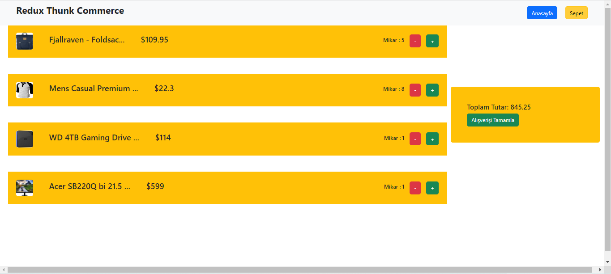

# Redux Thunk
- Thunk: Redux ta asekron işlemleri yönetmemize yarar. projenin çeşitli yerlerinden api isteği göndermek yerine bu istekler bir ...aciton.js dosyasında tutulur ve gerkli yerlerden çağrılır. Bununla beraber thunk sayesinde aksiyon tetiklenmeden önce api isteği gönderir

- Middleware : harici yazılımı redux a tanıtmak için kullanılan metod

## Kütüphaneler

- react-router-dom

# Kullanımı 
 öncelikle thunk projeye indirilir
 `npm i redux-thunk`

 - action klasöründe bir ...action.js dosyası oluşturulur ve api istekleri bu dosya içerisinde yapılır

```javascript
import axios from "axios";
import { todoActionTypes } from "./todoActionTypes";

export const getProduct = ()=> (dispatch) => {
    axios.get('/products').then((res) =>dispatch({
        type:todoActionTypes.SET_PRODUCTS,
        payload:res.data
    }))
}
```


 daha sonra store dosyasına thuk tanıtılır tanıtılır.

 ```javascript
 import thunk from "redux-thunk";

 export default createStore(rootReducer,applyMiddleware(thunk));
 ```

 - thunk kullanmadan önce

 ```javascript
  axios.get('/products').then((res) => {
     dispatch({
      type:todoActionTypes.SET_PRODUCTS,
      payload:res.data
    })})
    .catch(err=> console.log(err))
 ```

 -thunk kullandıktan sonra

  `dispatch(getProduct())`


  

- 
  

